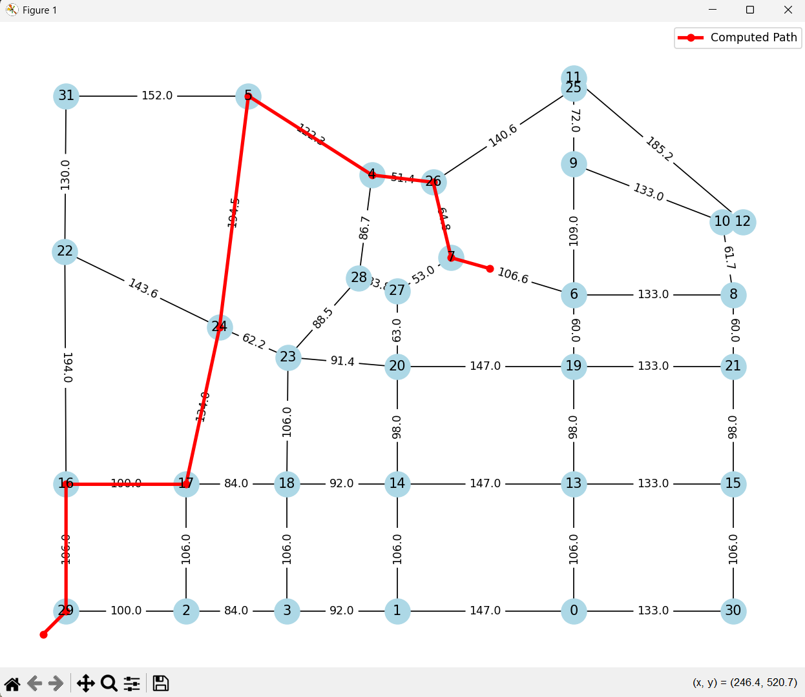
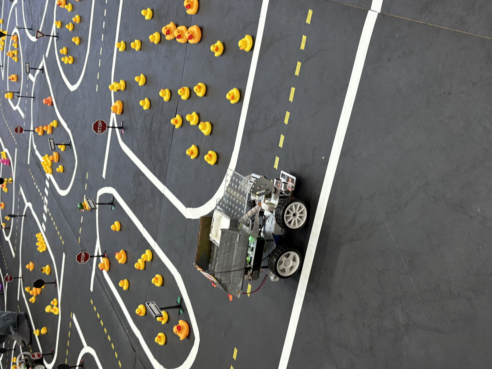

## Autonomous Taxi Navigation Module
This repository contains the navigation logic I developed as part of a larger autonomous taxi system for a university design project. The system enables a self-driving vehicle to traverse a city map, respond to dynamic fare requests, and optimize path planning based on performance metrics.

## My Contributions

- Implemented Dijkstra’s algorithm for shortest pathfinding on a bidirectional road graph.  
- Integrated real-time vehicle position tracking with dynamic route updates.  
- Developed logic to interpret map waypoints into turn directives for accurate movement simulation. 
- Designed fare selection algorithms prioritizing reward and reputation metrics.  
- Added visual debugging tools to display path choices and traffic behavior.  

## Sample Output
### Pathfinding Visualization

## Tech Stack

- Python 3  
- NetworkX for graph traversal  
- Matplotlib for visualization  
- JSON-based map and fare data handling  

## Project Context

This module was part of a full-stack simulation involving vehicle control, API-based fare requests (VPFS), and real-time performance monitoring. My work focused specifically on enabling smart and efficient route decision-making under time and environmental constraints.